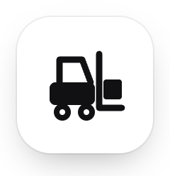
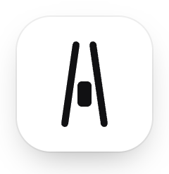
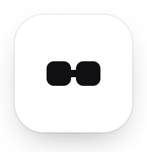
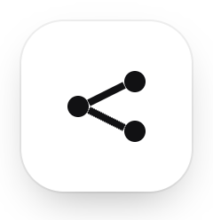
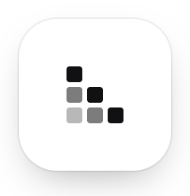

 

## Hi, I'm Stefan.

I build apps for everyday work, from the first sketch to the finished product. I care about clear interfaces, thoughtful interactions, and the small details that make software feel good to use.

**Web apps &nbsp; / &nbsp; Interface design &nbsp; / &nbsp; Interaction & motion**

 

<!-- projects:start -->
## Open-source projects

Built from scratch, no frameworks. Each one runs live in the browser.

<table>
<tr>
<td colspan="2" valign="top">

 <b>forklift</b> &nbsp;new 
A forklift robot works a warehouse: plans routes, lifts packages and really decodes their QR labels from pixels. 
<a href="https://stxqq.github.io/forklift/">Live demo</a> &nbsp;·&nbsp; <a href="https://github.com/Stxqq/forklift">Source</a>
</td>
</tr>
<tr>
<td width="50%" valign="top">

 <b>Self-driving car</b> 
A neural network evolved in the browser that signals, overtakes and keeps right. 
<a href="https://stxqq.github.io/self-driving-car/">Live demo</a> &nbsp;·&nbsp; <a href="https://github.com/Stxqq/self-driving-car">Source</a>
</td>
<td width="50%" valign="top">

 <b>bytepair</b> 
The GPT-4 tokenizer from scratch in Python, identical to tiktoken. 
<a href="https://stxqq.github.io/bytepair/">Live demo</a> &nbsp;·&nbsp; <a href="https://github.com/Stxqq/bytepair">Source</a>
</td>
</tr>
<tr>
<td width="50%" valign="top">

 <b>conveyor</b> 
A small ML pipeline engine with caching, lineage and a live DAG view. 
<a href="https://stxqq.github.io/conveyor/">Live demo</a> &nbsp;·&nbsp; <a href="https://github.com/Stxqq/conveyor">Source</a>
</td>
<td width="50%" valign="top">

 <b>pocket-gpt</b> 
A GPT trained from scratch in NumPy that runs right in your browser. 
<a href="https://stxqq.github.io/pocket-gpt/">Live demo</a> &nbsp;·&nbsp; <a href="https://github.com/Stxqq/pocket-gpt">Source</a>
</td>
</tr>
</table>
<!-- projects:end -->

 

About this activity

Updated daily and after changes to this profile. The heatmap counts my commits on the default branches of my own public repositories over the past 365 days. Private repositories, forks, and automated profile updates are excluded.

[Update status](https://github.com/Stxqq/Stxqq/actions/workflows/profile-activity.yml) · [How it works](scripts/README.md)

 

## What I focus on

**Useful products.** Apps that make everyday tasks easier.

**Clear interfaces.** Thoughtful layouts that help people find their way.

**Considered motion.** Small interactions that give useful feedback.
