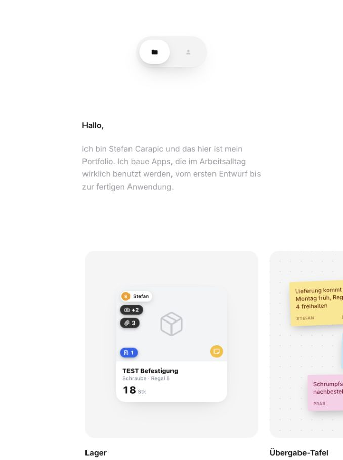

 

## Hi, ich bin Stefan.

Ich baue Apps, die im Arbeitsalltag wirklich benutzt werden — vom ersten Entwurf bis zur fertigen Anwendung. Mein Fokus liegt auf klaren Oberflächen, durchdachten Abläufen und Animationen, die sich gut anfühlen.

**Web-Apps &nbsp; / &nbsp; UI-Design &nbsp; / &nbsp; Interaktion & Motion**

 

## Mein Portfolio

Ein Blick in meine Projekte: kleine Details, echte Oberflächen und interaktive Demos.

<table>
  <tr>
    <td width="45%" align="center">
      
    </td>
    <td width="55%" valign="top">
      <h3>Stefan Carapic — Portfolio</h3>
      
Eine persönliche Sammlung meiner Arbeit an Apps und Interfaces.

      
<strong>Lager & Finanzen</strong> Artikel, Bestände und Kennzahlen auf einen Blick.

      
<strong>Übergabe-Tafel</strong> Notizen und Absprachen im Team.

      
<strong>Mitarbeiter-Rabatt</strong> Ein digitaler Rabatt mit QR-Ticket.

      
<strong>Kalender & Binvara Punkte</strong> Termine, Fortschritt und kleine Interaktionen.

       
      
<strong>Website noch nicht veröffentlicht.</strong> Hier siehst du eine Vorschau des aktuellen lokalen Portfolios.

      
<a href="assets/portfolio-preview.png">Vorschau in voller Größe ansehen ↗</a>

    </td>
  </tr>
</table>

 

## Meine Aktivität

Die Karte aktualisiert sich **täglich und nach Änderungen an diesem Profil**. Sie zeigt meine öffentlichen Commits in den Standard-Branches eigener Repositories während der letzten 365 Tage. Private Projekte, Forks und automatische Profil-Updates werden nicht mitgezählt.

[Aktualisierungsstatus ansehen](https://github.com/Stxqq/Stxqq/actions/workflows/profile-activity.yml) · [Wie die Heatmap entsteht](scripts/README.md)

 

## So arbeite ich

| Gestaltung | Umsetzung | Feinschliff |
| :--- | :--- | :--- |
| Klare Hierarchie und ruhige Oberflächen. | Apps für konkrete Aufgaben im Alltag. | Interaktionen, Bewegung und die Details dazwischen. |
